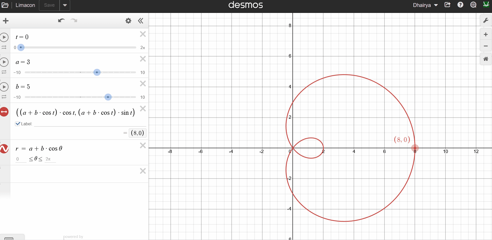

# ChronoTrace

## Inverse Kinematics 

So, this is a basic implementation of inverse kinematics using the `fsolve` function from `scipy.optimize` library. I am chaning the x position continously so the arm is moving in one direction continuously.
This shows that the implementation of inverse kinematics is correct as the function is trying to minimize the error.

https://github.com/user-attachments/assets/8dfa9af7-4f64-4de6-8ef5-df8fe7004448

## Trajectory Planning 

For implementing a simple trajectory with inverse kinematics I have decided to go with a lemicon which is basically a graph as shown below. Using the x and y coordinates from the graph I will change them over time
in the end effector pose which will in turn enable the arm to follow the below trajectory. 

