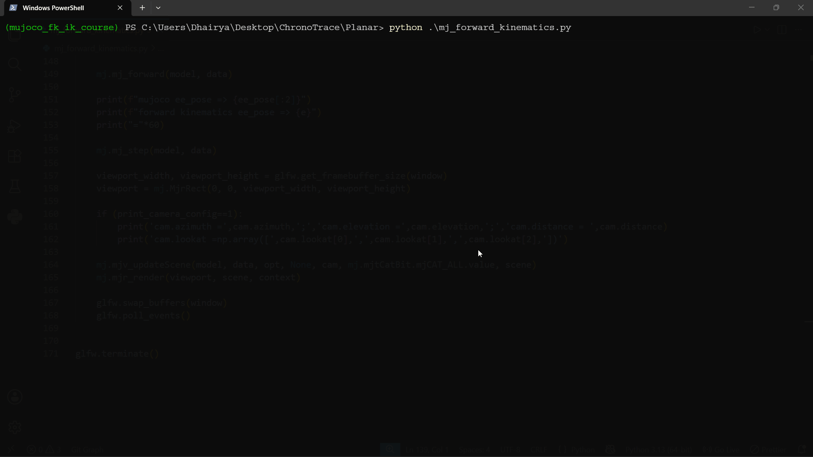

# ChronoTrace

I started this project in order to learn and develop my skills on inverse and forward kinematics and mujoco physics simulator. But while 
building this whole thing and learning about it, I also understood graphs, rotations, euler angles, quaternions and many more things that
are not the center part of an algorithm but does build the foundation of it. My main goal from this project was to learn these 
foundational / fundamental things no matter how much time it takes me to implement and understand them.

## Forward Kinematics (Planar)

So, this is a basic implementation of forward kinematics (planar). I have simple used cuboids as links and added joints between them. 
Then I have predefined the values from xml into the code and just calculated the homogenous matrices to extracted the `(x, y, theta)`.

## Inverse Kinematics (Spatial)

So, this is a basic implementation of inverse kinematics (spatial) using the `fsolve` function from `scipy.optimize` library. I am 
chaning the x position continously so the arm is moving in one direction continuously. This shows that the implementation of inverse 
kinematics is correct as the function is trying to minimize the error.

## Trajectory Planning  

For implementing a simple trajectory with inverse kinematics I have decided to go with a lemicon which is basically a graph as shown below. Using the x and y coordinates from the graph I will change them over time in the end effector pose which will in turn enable the 
arm to follow the below trajectory. 

Now, using my inverse kinematics code, I have implemented the following above trajectory in a function which generates the points and 
feeds it to the arm and it calculates the appropriate joint angles in order to minimize error.

## Resources 

- Pranav Bhounsule - https://youtube.com/playlist?list=PLc7bpbeTIk75Pvzvl5y92iAI-6vEv1kxM&si=h6EA5jcWq7OSVV1q

- Desmos - https://www.desmos.com/

- RosRoboticsLearning - https://www.rosroboticslearning.com/

- MuJoCo Docs - https://mujoco.readthedocs.io/en/stable/overview.html

- MuJoCo Menagerie (Ur5e) - https://github.com/google-deepmind/mujoco_menagerie